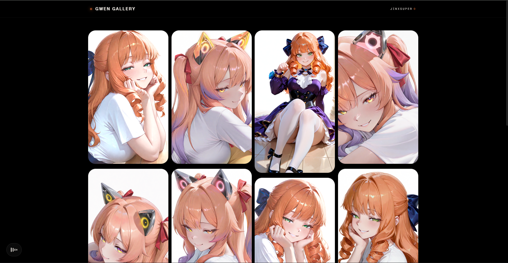

# Gwen Gallery

A cinematic image gallery built with modern web technologies.

🔗 **Live Demo**: [jinxsuper-gwen-gallery.vercel.app](https://jinxsuper-gwen-gallery.vercel.app)

## Preview

| Loading Screen | Gallery |
|---|---|
|  |  |

## Features

- Cinematic preloader with GSAP entrance animation
- Adaptive infinite scroll (120 FPS optimized)
- Dynamic watermark on image download
- Smooth scroll with Lenis
- Responsive glassmorphism UI

## Tech Stack

[](https://react.dev)
[](https://vitejs.dev)
[](https://tailwindcss.com)
[](https://gsap.com)
[](https://www.framer.com/motion)
[](https://lenis.darkroom.engineering)

## Getting Started

> Fork this repo first before cloning.

```bash
git clone https://github.com/YOUR_USERNAME/gwen-gallery-web.git
cd gwen-gallery-web
npm install
npm run dev
```

## Build

```bash
npm run build
```

---

Made by [JinXSuper](https://github.com/JinXSuper)
